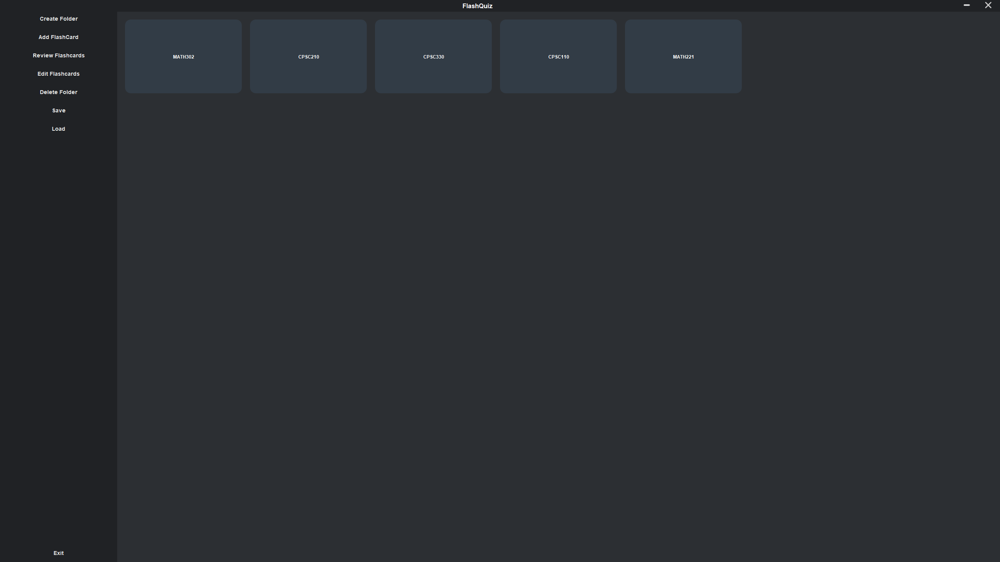

# FlashQuiz: A Customizable Flashcard Application

## Overview
**FlashQuiz** is a Java-based desktop application tailored for learners and educators. It offers a dynamic and interactive way to study and memorize information using digital flashcards. This tool is especially beneficial for students and teachers who are looking to create customized learning materials in an engaging and structured format.

## Features

### Flippable Flashcards
- **Interactive Learning**: Users can create flashcards with a question on one side and the answer on the other, facilitating an interactive study session.

### Folders for Categorization
- **Organized Learning**: Flashcards can be organized into folders based on different topics or subjects, which helps maintain a structured approach to studying various themes or subjects.

### Study Timer
- **Time Management**: Incorporates a built-in timer to track how long it takes to answer each flashcard, providing valuable feedback on the user’s learning pace and efficiency.

## How to Use FlashQuiz

### Creating and Managing Flashcards

1. **Creating a New Folder**
    - Open FlashQuiz and click on the "Create Folder" button in the sidebar.
    - Enter a name for your folder and click 'OK'. This folder will be used to organize related flashcards.

2. **Adding Flashcards**
    - Select a folder from the sidebar and click the "Add FlashCard" button.
    - Enter the question and answer for the flashcard and click 'Save'. The flashcard will be added to your selected folder.

### Reviewing and Editing Flashcards

1. **Reviewing Flashcards**
    - Click on the "Review Flashcards" button in the sidebar.
    - Select the folder containing the flashcards you wish to review.
    - Use the 'Next' and 'Show Answer' buttons to navigate through the flashcards.

2. **Editing Flashcards**
    - Click on the "Edit Flashcards" button in the sidebar.
    - Select the folder and the specific flashcard you wish to edit.
    - Modify the question or answer and click 'Update' to save changes.

### Saving Your Progress

- FlashQuiz automatically saves your progress when you exit the application. However, you can manually save your data at any time by clicking the "Save" button in the sidebar.

This brief guide should help you get started with FlashQuiz. Explore the application to discover more ways it can assist in your study routines!

